# PHP and MySQL Code Examples

Worked code examples for the PHP and MySQL chapter, drawn from the material used in the course. These are server-side examples: they run on a server with PHP and a MySQL database rather than in the browser, so each one is presented as source code with a description of the result it produces.

!!! note "About these examples"
    These examples query two sample tables, `ChildrensAuthors` and `ChildrensClassics`, and assume a `connect.php` file that opens the database connection. Because they depend on a database, they are shown here as code with a description of their output rather than as a live preview. This is a standard way to share server-side code.

## The Sample Tables

The JOIN examples below query two tables, `ChildrensClassics` and `ChildrensAuthors`, shown here so you can follow what each join returns.

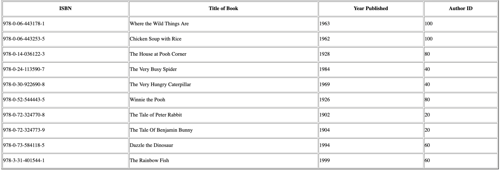

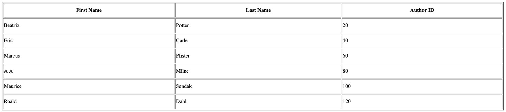

## JOINs

### INNER JOIN

Joins the `ChildrensAuthors` and `ChildrensClassics` tables on `AuthorID`, returning only authors that have matching books, and prints the result as an HTML table.

```php
<!DOCTYPE html>
<html>
<head>
<meta charset="UTF-8">
<title>INNER JOIN</title>
</head>
<?php
//File that includes the code to connect to the MySQL server
include "connect.php";
//query that demonstrates an INNER JOIN on the tables ChildrensAuthors and ChildrensClassics
$innerJoinQuery = "SELECT ChildrensAuthors.AuthorID, FirstName, LastName, BookTitle, YearPublished, ISBN FROM ChildrensAuthors INNER JOIN ChildrensClassics ON ChildrensAuthors.AuthorID = ChildrensClassics.AuthorID";
//Execute the query
$result = mysqli_query($con,$innerJoinQuery);
if(!$result)
  {
    echo "Error: "  . $result . "<br>" . $con->error;
  }
//Print the table from records retrieved from the query
echo "<table align= 'center' border='2px' style='width: 1500px; line-height:40px;'>
<tr>
<th>Author ID</th>
<th>First Name</th>
<th>Last Name</th>
<th>Title of Book</th>
<th>Year Published</th>
<th>ISBN</th>
</tr>";
while($row = mysqli_fetch_array($result))
{
echo "<tr>";
echo "<td>" . $row['AuthorID'] . "</td>";
echo "<td>" . $row['FirstName'] . "</td>";
echo "<td>" . $row['LastName'] . "</td>";
echo "<td>" . $row['BookTitle'] . "</td>";
echo "<td>" . $row['YearPublished'] . "</td>";
echo "<td>" . $row['ISBN'] . "</td>";
echo "</tr>";
  }
echo "</table>";
?>
</html>
```

**Produces:** a table of authors paired with their books, listing only authors who have at least one matching book in the classics table. Authors with no matching book do not appear.

??? note "Check your understanding"
    Think about what the code above will produce, then expand to compare with the actual output.

    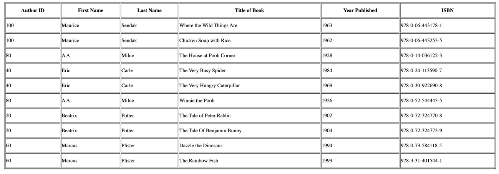

[View full source](https://github.com/wYaobiz/code-to-cloud-resources/blob/main/src/ch10-php-mysql/inner-join/index.php){ .md-button }

### LEFT JOIN

Returns every author from the left table, along with any matching books from the right table.

```php
<!DOCTYPE html>
<html>
<head>
<meta charset="UTF-8">
<title>LEFT JOIN</title>
</head>
<?php
//File that includes the code to connect to the MySQL server
include "connect.php";
//query that demonstrates an LEFT JOIN on the tables ChildrensAuthors and //ChildrensClassics
$leftJoinQuery = "SELECT ChildrensAuthors.AuthorID, FirstName, LastName, BookTitle, YearPublished, ISBN FROM ChildrensAuthors LEFT JOIN  ChildrensClassics ON ChildrensAuthors.AuthorID = ChildrensClassics.AuthorID";
//Execute the query
$result = mysqli_query($con,$leftJoinQuery);
if(!$result)
  {
    echo "Error: "  . $result . "<br>" . $con->error;
  }
//Print the table from records retrieved from the query
echo "<table align= 'center' border='2px' style='width: 1500px; line-height:40px;'>
<tr>
<th>Author ID</th>
<th>First Name</th>
<th>Last Name</th>
<th>Title of Book</th>
<th>Year Published</th>
<th>ISBN</th>
</tr>";
while($row = mysqli_fetch_array($result))
{
echo "<tr>";
echo "<td>" . $row['AuthorID'] . "</td>";
echo "<td>" . $row['FirstName'] . "</td>";
echo "<td>" . $row['LastName'] . "</td>";
echo "<td>" . $row['BookTitle'] . "</td>";
echo "<td>" . $row['YearPublished'] . "</td>";
echo "<td>" . $row['ISBN'] . "</td>";
echo "</tr>";
  }
echo "</table>";
?>
</html>
```

**Produces:** a table listing all authors, with book details filled in where a match exists and left blank where an author has no matching book.

??? note "Check your understanding"
    Think about what the code above will produce, then expand to compare with the actual output.

    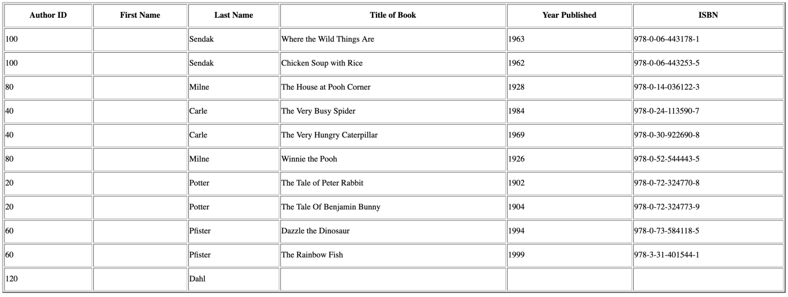

[View full source](https://github.com/wYaobiz/code-to-cloud-resources/blob/main/src/ch10-php-mysql/left-join/index.php){ .md-button }

### RIGHT JOIN

Returns every book from the right table, along with any matching author from the left table.

```php
<!DOCTYPE html>
<html>
<head>
<meta charset="UTF-8">
<title>Untitled Document</title>
</head>
<?php
//File that includes the code to connect to the MySQL server
include "connect.php";
/*query that demonstrates a RIGHT JOIN on the tables ChildrensAuthors and ChildrensClassics*/
$rightJoinQuery = "SELECT ChildrensAuthors.AuthorID, FirstName, LastName, BookTitle, YearPublished, ISBN FROM ChildrensAuthors RIGHT JOIN  ChildrensClassics ON ChildrensAuthors.AuthorID = ChildrensClassics.AuthorID";
//Execute the query
$result = mysqli_query($con,$rightJoinQuery);
if(!$result)
  {
    echo "Error: "  . $result . "<br>" . $con->error;
  }
//Print the table from records retrieved from the query
echo "<table align= 'center' border='2px' style='width: 1500px; line-height:40px;'>
<tr>
<th>Author ID</th>
<th>First Name</th>
<th>Last Name</th>
<th>Title of Book</th>
<th>Year Published</th>
<th>ISBN</th>
</tr>";
while($row = mysqli_fetch_array($result))
{
echo "<tr>";
echo "<td>" . $row['AuthorID'] . "</td>";
echo "<td>" . $row['FirstName'] . "</td>";
echo "<td>" . $row['LastName'] . "</td>";
echo "<td>" . $row['BookTitle'] . "</td>";
echo "<td>" . $row['YearPublished'] . "</td>";
echo "<td>" . $row['ISBN'] . "</td>";
echo "</tr>";
  }
echo "</table>";
?>
</html>
```

**Produces:** a table listing all books, with author details filled in where a match exists and left blank where a book has no matching author.

??? note "Check your understanding"
    Think about what the code above will produce, then expand to compare with the actual output.

    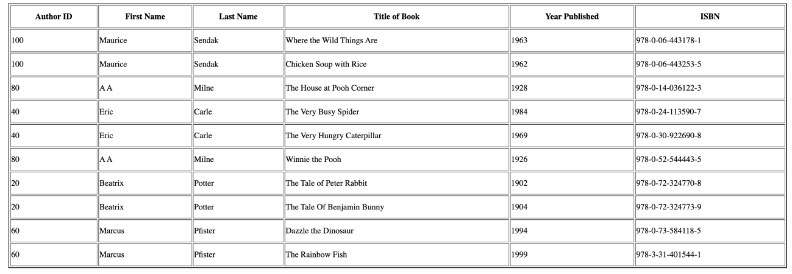

[View full source](https://github.com/wYaobiz/code-to-cloud-resources/blob/main/src/ch10-php-mysql/right-join/index.php){ .md-button }

## Aggregate Functions

The aggregate examples below use the following table.

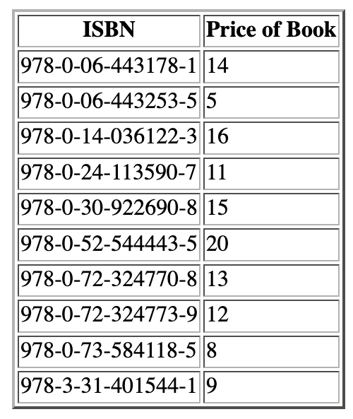


### COUNT() function

Counts how many ISBN values appear in the `ChildrensClassicsPrice` table.

```php
<!DOCTYPE html>
<html>
<head>
<meta charset="UTF-8">
<title>COUNT() Function</title>
</head>
<?php
//File that includes the code to connect to the MySQL server
include "connect.php";
//Query that demonstrates Aggregate functions COUNT()
$query = "SELECT COUNT(ISBN) AS ISBNCOUNT FROM ChildrensClassicsPrice";
//Execute the query
$result = mysqli_query($con,$query);
if(!$result)
 {
    echo "Error: "  . $query . "<br>" . $con->error;
  }
//Print the table from the results from the query
echo "<table align= 'center' border='2px' line-height:40px;'>
<tr>
<th>Number of ISBNs</th>
</tr>";
while($row = mysqli_fetch_array($result))
{
echo "<tr>";
echo "<td>" . $row['ISBNCOUNT'] . "</td>";
echo "</tr>";
  }
echo "</table>";
?>
</html>
```

**Produces:** a single-cell table showing the total number of ISBNs counted.

??? note "Check your understanding"
    Think about what the code above will produce, then expand to compare with the actual output.

    

[View full source](https://github.com/wYaobiz/code-to-cloud-resources/blob/main/src/ch10-php-mysql/count-function/index.php){ .md-button }

### MIN(), MAX() and AVG() functions

Returns the lowest, highest, and average value of a numeric column.

```php
<!DOCTYPE html>
<html>
<head>
<meta charset="UTF-8">
<title>MIN(), MAX() and AVG() functions</title>
</head>
<?php
//File that includes the code to connect to the MySQL server
include "connect.php";
//Query that demonstrates Aggregate functions MIN(), MAX() and AVG()
$query = "SELECT MIN(PRICE) AS LowestPrice, MAX(PRICE) AS HighestPrice, AVG(Price) AS AveragePrice FROM ChildrensClassicsPrice";
//Execute the query
$result = mysqli_query($con,$query);
if(!$result)
 {
    echo "Error: "  . $query . "<br>" . $con->error;
  }
//Print the table from the results from the query
echo "<table align= 'center' border='2px' line-height:40px;'>
<tr>
<th>Lowest Priced Book</th>
<th>Highest Priced Book</th>
<th>Average Price of Books</th>
</tr>";
while($row = mysqli_fetch_array($result))
{
echo "<tr>";
echo "<td>" . $row['LowestPrice'] . "</td>";
echo "<td>" . $row['HighestPrice'] . "</td>";
echo "<td>" . $row['AveragePrice'] . "</td>";
echo "</tr>";
  }
echo "</table>";
?>
</html>
```

**Produces:** a table with one row showing the minimum, maximum, and average values calculated across the column.

??? note "Check your understanding"
    Think about what the code above will produce, then expand to compare with the actual output.

    

[View full source](https://github.com/wYaobiz/code-to-cloud-resources/blob/main/src/ch10-php-mysql/min-max-avg/index.php){ .md-button }

### GROUP_CONCAT() with GROUP BY

Groups the classics by `AuthorID` and combines each author's book titles into a single value.

```php
<!DOCTYPE html>
<html>
<head>
<meta charset="UTF-8">
<title>Untitled Document</title>
</head>
<?php
//File that includes the code to connect to the MySQL server
include "connect.php";
//Query that demonstrates Aggregate functions GROUP_CONACT()
$query = "SELECT AuthorID, GROUP_CONCAT(BookTitle) AS BookTitle FROM ChildrensClassics GROUP BY AuthorID";
//Execute the query
$result = mysqli_query($con,$query);
if(!$result)
  {
    echo "Error: "  . $query . "<br>" . $con->error;
  }
//Print the table from the results from the query
echo "<table align= 'center' border='2px' line-height:40px;'>
<tr>
<th>Author ID</th>
<th>Title of Book</th>
</tr>";
while($row = mysqli_fetch_array($result))
{
echo "<tr>";
echo "<td>" . $row['AuthorID'] . " </td>";
echo "<td>" . $row['BookTitle'] . "</td>";
echo "</tr>";
  }
echo "</table>";
?>
</html>
```

**Produces:** a table where each author appears once, with all of that author's book titles combined into one cell.

??? note "Check your understanding"
    Think about what the code above will produce, then expand to compare with the actual output.

    

[View full source](https://github.com/wYaobiz/code-to-cloud-resources/blob/main/src/ch10-php-mysql/group-concat/index.php){ .md-button }

## Comparison and Conditional Functions

The comparison and conditional examples below use the following table.

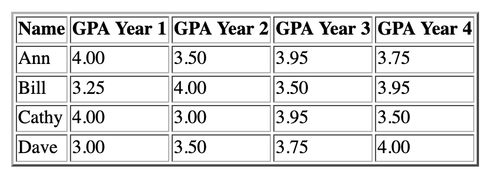


### GREATEST() function

Returns the largest value from a list of expressions.

```php
<!DOCTYPE html>
<html>
<head>
<meta charset="UTF-8">
<title>GREATEST function</title>
</head>
<?php
//File that includes the code to connect to the MySQL server
include "connect.php";
//Query that demonstrates GREATEST () function
$query = "Select Name, GREATEST (GPAYear1, GPAYear4, GPAYear3 ,GPAYear4) AS Highest_GPA FROM GPA";
//Execute the query
$result = mysqli_query($con,$query);
if(!$result)
  {
    echo "Error: "  . $query . "<br>" . $con->error;
  }
//Print the table from the results from the query
echo "<table align= 'center' border='2px' line-height:40px;'>
<tr>
<th>Name</th>
<th>Highest GPA</th>
</tr>";
while($row = mysqli_fetch_array($result))
{
echo "<tr>";
echo "<td>" . $row['Name'] . " </td>";
echo "<td>" . $row['Highest_GPA'] . " </td>";
echo "</tr>";
  }
echo "</table>";
?>
</html>
```

**Produces:** a table showing the greatest value selected from the compared columns for each row.

??? note "Check your understanding"
    Think about what the code above will produce, then expand to compare with the actual output.

    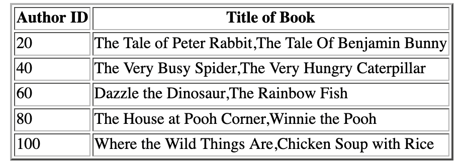

[View full source](https://github.com/wYaobiz/code-to-cloud-resources/blob/main/src/ch10-php-mysql/greatest-function/index.php){ .md-button }

### LEAST() function

Returns the smallest value from a list of expressions.

```php
<!DOCTYPE html>
<html>
<head>
<meta charset="UTF-8">
<title>LEAST function</title>
</head>
<?php
//File that includes the code to connect to the MySQL server
include "connect.php";
//Query that demonstrates LEAST () function
$query = "Select Name, LEAST (GPAYear1, GPAYear4, GPAYear3 ,GPAYear4) AS Lowest_GPA FROM GPA";
//Execute the query
$result = mysqli_query($con,$query);
if(!$result)
  {
    echo "Error: "  . $query . "<br>" . $con->error;
  }
//Print the table from the results from the query
echo "<table align= 'center' border='2px' line-height:40px;'>
<tr>
<th>Name</th>
<th>Highest GPA</th>
</tr>";
while($row = mysqli_fetch_array($result))
{
echo "<tr>";
echo "<td>" . $row['Name'] . " </td>";
echo "<td>" . $row['Lowest_GPA'] . " </td>";
echo "</tr>";
  }
echo "</table>";
?>
</html>
```

**Produces:** a table showing the smallest value selected from the compared columns for each row.

??? note "Check your understanding"
    Think about what the code above will produce, then expand to compare with the actual output.

    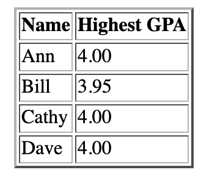

[View full source](https://github.com/wYaobiz/code-to-cloud-resources/blob/main/src/ch10-php-mysql/least-function/index.php){ .md-button }

### IF() function

Returns one of two values depending on whether a condition is true.

```php
<!DOCTYPE html>
<html>
<head>
<meta charset="UTF-8">
<title>IF() function</title>
</head>
<?php
//File that includes the code to connect to the MySQL server
include "connect.php";
//Query that demonstrates IF()
$query = "SELECT Name, GPAYear1, IF(GPAYear1 = 4, 'Perfect GPA', 'NOT A perfect GPA') AS Message FROM GPA";
//Execute the query
$result = mysqli_query($con,$query);
if(!$result)
  {
    echo "Error: "  . $query . "<br>" . $con->error;
  }
//Print the table from the results from the query
echo "<table align= 'center' border='2px' line-height:40px;'>
<tr>
<th>Name</th>
<th>GPA Year 1</th>
<th> Perfect GPA</th>
</tr>";
while($row = mysqli_fetch_array($result))
{
echo "<tr>";
echo "<td>" . $row['Name'] . " </td>";
echo "<td>" . $row['GPAYear1'] . " </td>";
echo "<td>" . $row['Message'] . " </td>";
echo "</tr>";
  }
echo "</table>";
?>
</html>
```

**Produces:** a table where a column shows one label or another based on the tested condition for each row.

??? note "Check your understanding"
    Think about what the code above will produce, then expand to compare with the actual output.

    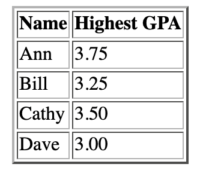

[View full source](https://github.com/wYaobiz/code-to-cloud-resources/blob/main/src/ch10-php-mysql/if-function/index.php){ .md-button }

### CASE expression

Chooses a result based on the first matching condition in a set.

```php
<!DOCTYPE html>
<html>
<head>
<meta charset="UTF-8">
<title>CASE() Function</title>
</head>
<?php
//File that includes the code to connect to the MySQL server
include "connect.php";
//Query that demonstrates CASE () function
$query = "SELECT Name, GPAYear1, CASE WHEN GPAYear1 = 4 THEN 'GPA is A' WHEN GPAYEAR1 >=3 THEN 'GPA is B' ELSE 'GPA is lower than B' END AS Message FROM GPA";
//Execute the query
$result = mysqli_query($con,$query);
if(!$result)
  {
    echo "Error: "  . $query . "<br>" . $con->error;
  }
//Print the table from the results from the query
echo "<table align= 'center' border='2px' line-height:40px;'>
<tr>
<th>Name</th>
<th>GPA Year 1</th>
<th>GPA Grade Value</th>
</tr>";
while($row = mysqli_fetch_array($result))
{
echo "<tr>";
echo "<td>" . $row['Name'] . " </td>";
echo "<td>" . $row['GPAYear1'] . " </td>";
echo "<td>" . $row['Message'] . " </td>";
echo "</tr>";
  }
echo "</table>";
?>
</html>
```

**Produces:** a table where each row shows the value produced by the first matching branch of the CASE expression.

??? note "Check your understanding"
    Think about what the code above will produce, then expand to compare with the actual output.

    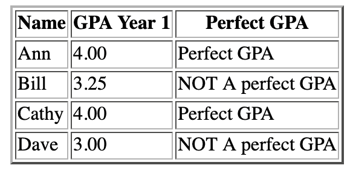

[View full source](https://github.com/wYaobiz/code-to-cloud-resources/blob/main/src/ch10-php-mysql/case-function/index.php){ .md-button }

### IFNULL() function

Substitutes a specified value wherever an expression is NULL.

```php
<!DOCTYPE html>
<html>
<head>
<meta charset="UTF-8">
  <title>IFNULL() Function</title>
<?php
//File that includes the code to connect to the MySQL server
include "connect.php";
//Query that demonstrates IFNULL () function
$query = "SELECT IFNULL((SELECT Name FROM GPA WHERE Name = 'Sarah'), 'NULL') AS NAME";
//Execute the query
$result = mysqli_query($con,$query);
if(!$result)
  {
    echo "Error: "  . $query . "<br>" . $con->error;
  }
//Print the table from the results from the query
echo "<table align= 'center' border='2px' line-height:40px;'>
<tr>
<th>Name</th>
</tr>";
while($row = mysqli_fetch_array($result))
{
echo "<tr>";
echo "<td>" . $row['NAME'] . " </td>";
echo "</tr>";
  }
echo "</table>";
?>
</html>
```

**Produces:** a table where any NULL value is replaced by the supplied default, and other values appear unchanged.

??? note "Check your understanding"
    Think about what the code above will produce, then expand to compare with the actual output.

    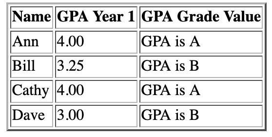

[View full source](https://github.com/wYaobiz/code-to-cloud-resources/blob/main/src/ch10-php-mysql/ifnull-function/index.php){ .md-button }

## The Sample Table

The mysqli and PDO examples below all query the same `Pets` table, shown here so you can follow what each query returns.

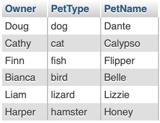

## Working with mysqli

### mysqli_num_rows()

Runs a SELECT against the `Pets` table and counts the rows returned.

```php
<!DOCTYPE html>
<html>
<head>
<meta charset="UTF-8">
<title> mysqli function mysqli_num_rows</title>
</head>
<?php
// File that includes information such as host server name, username, database name and //password needed to connect to the database server
include('connect.php');
//Connect to the MySqL server
if (mysqli_connect_errno())
  {
     echo "Failed to connect to MySQL: " . mysqli_connect_error();
  }
// Create a SELECT query that retrieves all the records from a DB table called Pets
$query = "SELECT * FROM Pets";
// Execute the SELECT query
 $petresults = mysqli_query($con, $query);
// Check if the query yielded a result set
if($petresults)
 {
   //Find the number of rows retrieved
   $row = mysqli_num_rows($petresults);
   //Print out the numbers of rows in the table
   if($row)
     {
       echo("Number of rows in the table : " . $row);
     }
     else
  {
   //Message printed if no rows found
   echo "No rows counted";
  }
}
else
 {
    //Message printed query does not work
     echo "Query Failed :" . mysqli_error($con);
 }
// Close the DB connection
mysqli_close($con);
?>
</html>
```

**Produces:** a line reporting how many rows the query found in the table, or a message if none were counted.

??? note "Check your understanding"
    Think about what the code above will produce, then expand to compare with the actual output.

    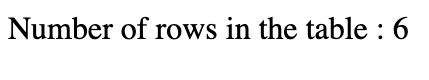

[View full source](https://github.com/wYaobiz/code-to-cloud-resources/blob/main/src/ch10-php-mysql/mysqli-num-rows/index.php){ .md-button }

### mysqli_fetch_assoc()

Loops through the result set, reading each row as an associative array so columns are reached by name.

```php
<!DOCTYPE html>
<html>
<head>
<meta charset="UTF-8">
<title> mysqli function mysqli_num_fetch_assoc</title>
</head>
<?php
// File that includes information such as host server, username, data base name and //password needed to connect to the database server
include('connect.php');
//Connect to the MySqL server
if (mysqli_connect_errno())
  {
     echo "Failed to connect to MySQL: " . mysqli_connect_error();
  }
// Create a SELECT query that retrieves all the records from a DB table called Pets
$query = "SELECT * FROM Pets";
// Execute the SELECT query
 $petresults = mysqli_query($con, $query);
// Check if the query yielded a result set
if($petresults)
 {
   //Loop through result set using mysqli_fetch_array(MYSQLI_ASSOC)
   while ($row = mysqli_fetch_assoc($petresults))
    {
     echo "<h4>Owner     Pet Name</h4>";
    //print the first and third elements
    echo $row["Owner"]."&nbsp". "&nbsp ". "&nbsp ". " &nbsp". "&nbsp ". $row["PetName"];
    echo "<br>";
  }
}
else
 {
     echo "Query Failed :" . mysqli_error($con);
 }
// Close the DB connection
mysqli_close($connect);
?>
</html>
```

**Produces:** each pet's owner and name printed in turn, with the values read by column name.

??? note "Check your understanding"
    Think about what the code above will produce, then expand to compare with the actual output.

    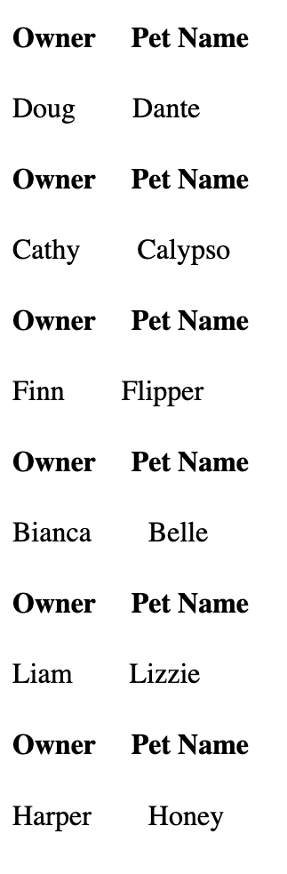

[View full source](https://github.com/wYaobiz/code-to-cloud-resources/blob/main/src/ch10-php-mysql/mysqli-fetch-assoc/index.php){ .md-button }

### mysqli_fetch_array()

Reads each row with the default behavior of mysqli_fetch_array().

```php
<!DOCTYPE html>
<html>
<head>
<meta charset="UTF-8">
<title> mysqli function mysqli_num_fetch_array</title>
</head>
<?php
// File that includes information such as host server, username, data base name and //password needed to connect to the database server
include('connect.php');
//Connect to the MySqL server
if (mysqli_connect_errno())
  {
     echo "Failed to connect to MySQL: " . mysqli_connect_error();
  }
// Create a SELECT query that retrieves all the records from a DB table called Pets
$query = "SELECT * FROM Pets";
// Execute the SELECT query
 $petresults = mysqli_query($con, $query);
// Check if the query yielded a result set
if($petresults)
 {
  //Loop through result set using mysqli_fetch_array
  while($row = mysqli_fetch_array($petresults))
  {
  echo "<h4>Owner     Pet Type</h4>";
    //print the first and second elements
    echo $row["Owner"]."&nbsp". "&nbsp ". "&nbsp ". " &nbsp". "&nbsp ". $row[1];
    echo "<br>";
  }
}
else
 {
     echo "Query Failed :" . mysqli_error($con);
 }
// Close the DB connection
mysqli_close($con);
?>
</html>
```

**Produces:** each row's values printed as the loop moves through the result set.

??? note "Check your understanding"
    Think about what the code above will produce, then expand to compare with the actual output.

    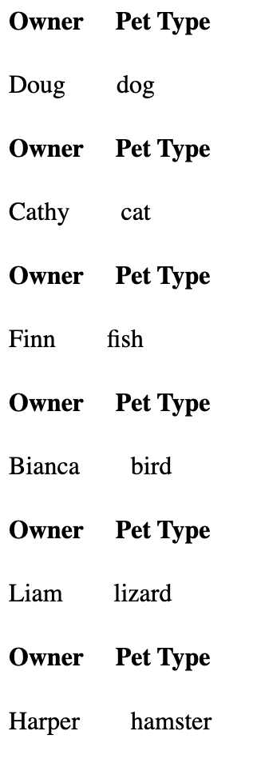

[View full source](https://github.com/wYaobiz/code-to-cloud-resources/blob/main/src/ch10-php-mysql/mysqli-fetch-array/index.php){ .md-button }

### mysqli_fetch_array() with MYSQLI_NUM

Passes MYSQLI_NUM so each row comes back indexed by position rather than by name.

```php
<!DOCTYPE html>
<html>
<head>
<meta charset="UTF-8">
<title> mysqli function mysqli_num_fetch_array(MYSQLI_NUM)</title>
</head>
<?php
// File that includes information such as host server, username, data base name and //password needed to connect to the database server
include('connect.php');
//Connect to the MySqL server
if (mysqli_connect_errno())
  {
     echo "Failed to connect to MySQL: " . mysqli_connect_error();
  }
// Create a SELECT query that retrieves all the records from a DB table called Pets
$query = "SELECT * FROM Pets";
// Execute the SELECT query
 $petresults = mysqli_query($con, $query);
// Check if the query yielded a result set
if($petresults)
 {
  //Loop through result set using mysqli_fetch_array(MYSQLI_NUM)
  while($row = mysqli_fetch_array($petresults, MYSQLI_NUM))
    {
     echo "<h4>Owner     Pet Name</h4>";
    //print the first and third elements
    echo $row[0]."&nbsp". "&nbsp ". "&nbsp ". " &nbsp". "&nbsp ". $row[2];
    echo "<br>";
  }
}
else
 {
     echo "Query Failed :" . mysqli_error($con);
 }
// Close the DB connection
mysqli_close($con);
?>
</html>
```

**Produces:** each row printed using numeric positions, giving the same values through index numbers instead of column names.

??? note "Check your understanding"
    Think about what the code above will produce, then expand to compare with the actual output.

    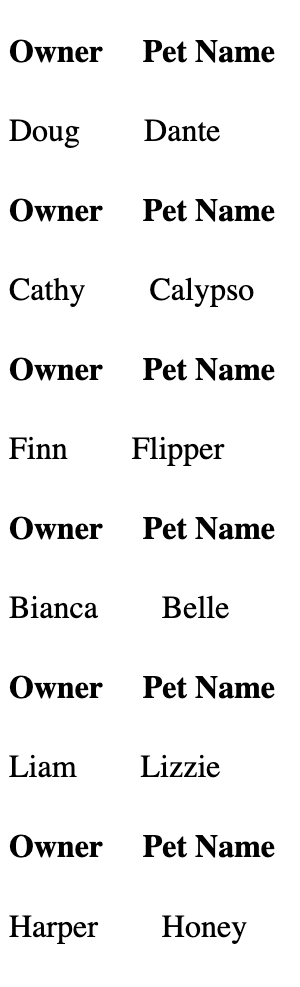

[View full source](https://github.com/wYaobiz/code-to-cloud-resources/blob/main/src/ch10-php-mysql/mysqli-fetch-array-num/index.php){ .md-button }

### mysqli_fetch_array() with MYSQLI_ASSOC

Passes MYSQLI_ASSOC so each row comes back keyed by column name.

```php
<!DOCTYPE html>
<html>
<head>
<meta charset="UTF-8">
<title> mysqli function mysqli_num_fetch_array(MYSQLI_NUM)</title>
</head>
<?php
// File that includes information such as host server, username, data base name and password needed to connect to the database server
include('connect.php');
//Connect to the MySqL server
if (mysqli_connect_errno())
  {
     echo "Failed to connect to MySQL: " . mysqli_connect_error();
  }
// Create a SELECT query that retrieves all the records from a DB table called Pets
$query = "SELECT * FROM Pets";
// Execute the SELECT query
 $petresults = mysqli_query($con, $query);
// Check if the query yielded a result set
if($petresults)
 {
   //Loop through result set using mysqli_fetch_array(MYSQLI_ASSOC)
  while($row = mysqli_fetch_array($petresults, MYSQLI_ASSOC))
    {
     echo "<h4>Owner     Pet Name</h4>";
    //print the first and third elements
    echo $row["Owner"]."&nbsp". "&nbsp ". "&nbsp ". " &nbsp". "&nbsp ". $row["PetName"];
    echo "<br>";
  }
}
else
 {
  //Output when query fails with error message
     echo "Query Failed :" . mysqli_error($con);
 }
// Close the DB connection
mysqli_close($con);
?>
nnect);
?>
</html>
```

**Produces:** each row printed using column names, matching the output of mysqli_fetch_assoc().

??? note "Check your understanding"
    Think about what the code above will produce, then expand to compare with the actual output.

    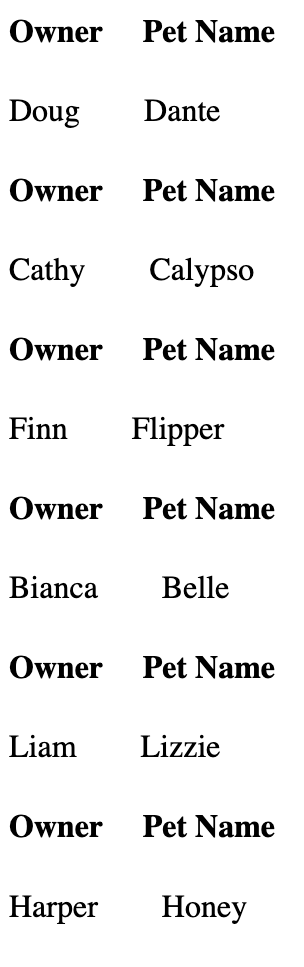

[View full source](https://github.com/wYaobiz/code-to-cloud-resources/blob/main/src/ch10-php-mysql/mysqli-fetch-array-assoc/index.php){ .md-button }

### mysqli_fetch_row()

Reads each row as a numerically indexed array.

```php
<!DOCTYPE html>
<html>
<head>
<meta charset="UTF-8">
<title> mysqli function mysqli_num_fetch_array(MYSQLI_NUM)</title>
</head>
<?php
// File that includes information such as host server, username, data base name and password needed to connect to the database server
include('connect.php');
//Connect to the MySqL server
if (mysqli_connect_errno())
  {
     echo "Failed to $con to MySQL: " . mysqli_connect_error();
  }
// Create a SELECT query that retrieves all the records from a DB table called Pets
$query = "SELECT * FROM Pets";
// Execute the SELECT query
 $petresults = mysqli_query($con, $query);
// Check if the query yielded a result set
if($petresults)
 {
   //Loop through result set using mysqli_fetch_row
   while ($row = mysqli_fetch_row($petresults))
    {
     echo "<h4>Pet Type    Owner</h4>";
    //print the first and third elements
    echo $row[1]."&nbsp". "&nbsp ". "&nbsp ". " &nbsp". "&nbsp ". " &nbsp". " &nbsp" . $row[0];
    echo "<br>";
  }
}
else
 {
     echo "Query Failed :" . mysqli_error($con);
 }
// Close the DB connection
mysqli_close($con);
?>
</html>
```

**Produces:** each row printed by position, with values reached through numeric indexes.

??? note "Check your understanding"
    Think about what the code above will produce, then expand to compare with the actual output.

    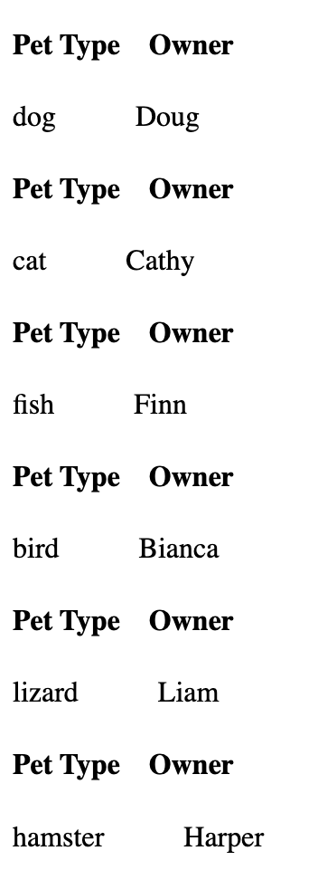

[View full source](https://github.com/wYaobiz/code-to-cloud-resources/blob/main/src/ch10-php-mysql/mysqli-fetch-row/index.php){ .md-button }

## Working with PDO

### PDO fetch() with the default mode

Connects with PDO inside a try/catch block and reads rows using fetch() with the default mode.

```php
<!DOCTYPE html>
<html>
<head>
<meta charset="UTF-8">
<title> mysqli function mysqli_num_fetch_array(MYSQLI_NUM)</title>
</head>
<?php
// File that includes information such as host server, username, data base name and password needed to connect to the database server
include('connect.php');
//Try catch block to catch connection errors
try
  {
    // Connect to your DB
    $connect = new PDO("mysql:host=$servername; dbname=$dbname", $username, $password);
    // set the PDO error mode to exception
    $connect->setAttribute(PDO::ATTR_ERRMODE, PDO::ERRMODE_EXCEPTION);
    //echo "Connected successfully";
       }
catch(PDOException $e)
      {
        echo "Connection failed: " . $e->getMessage();
      }
//Try catch block to catch SQL errors
try
  {
// Create a SELECT query that retrieves all the records from a DB table called Pets
$petquery="SELECT * FROM Pets";
// Execute the SELECT query
$petresults = $connect->query($petquery);
// Check if the SELECT query yielded a result set
if ($petresults)
 {
  //Loop through result set using fetch(PDO::FETCH_ASSOC)
    while($row = $petresults-> fetch())
  {
  echo "<h4>Owner     Pet Name</h4>";
  //print the first and second elements
  echo $row[0]."&nbsp". "&nbsp ". "&nbsp ". " &nbsp". "&nbsp ". $row[1];
  echo "<br>";
  }
}
}
//Catch block to catch errors
catch(PDOException $error)
  {
    echo "<br><br>";
  echo "Query Statement failed: " . $error->getMessage();
  }
// Close the DB connection
$connect=null;
?>
</html>
```

**Produces:** each pet's owner and name printed as the loop reads through the result set.

??? note "Check your understanding"
    Think about what the code above will produce, then expand to compare with the actual output.

    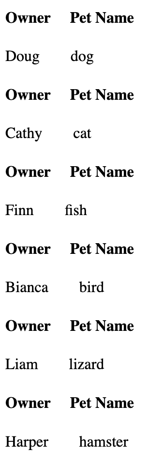

[View full source](https://github.com/wYaobiz/code-to-cloud-resources/blob/main/src/ch10-php-mysql/pdo-fetch-default/index.php){ .md-button }

### PDO fetch() with FETCH_ASSOC

Sets PDO::FETCH_ASSOC so rows come back keyed by column name.

```php
<!DOCTYPE html>
<html>
<head>
<meta charset="UTF-8">
<title> mysqli function mysqli_num_fetch_array(MYSQLI_NUM)</title>
</head>
<?php
// File that includes information such as host server, username, data base name and password needed to connect to the database server
include('connect.php');
//Try catch block to catch connection errors
try
  {
    // Connect to your DB
    $connect = new PDO("mysql:host=$servername; dbname=$dbname", $username, $password);
    // set the PDO error mode to exception
    $connect->setAttribute(PDO::ATTR_ERRMODE, PDO::ERRMODE_EXCEPTION);
    //echo "Connected successfully";
       }
catch(PDOException $e)
      {
        echo "Connection failed: " . $e->getMessage();
      }
//Try catch block to catch SQL errors
try
  {
// Create a SELECT query that retrieves all the records from a DB table called Pets
$petquery="SELECT * FROM Pets";
// Execute the SELECT query
$petresults = $connect->query($petquery);
// Check if the SELECT query yielded a result set
if ($petresults)
 {
  //Loop through result set using fetch(PDO::FETCH_ASSOC)
    while($row = $petresults-> fetch(PDO::FETCH_ASSOC))
  {
  echo "<h4>Owner     Pet Name</h4>";
  //print the first and third elements
  echo $row["Owner"]."&nbsp". "&nbsp ". "&nbsp ". " &nbsp". "&nbsp ". $row["PetName"];
    echo "<br>";
  }
}
}
//Catch block to catch errors
catch(PDOException $error)
  {
    echo "<br><br>";
  echo "Query Statement failed: " . $error->getMessage();
  }
// Close the DB connection
$connect=null;
?>
</html>
```

**Produces:** each row printed using column names.

??? note "Check your understanding"
    Think about what the code above will produce, then expand to compare with the actual output.

    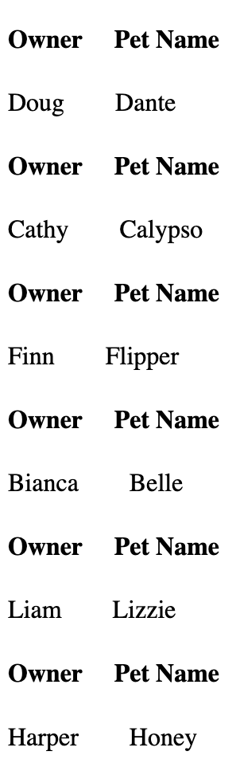

[View full source](https://github.com/wYaobiz/code-to-cloud-resources/blob/main/src/ch10-php-mysql/pdo-fetch-assoc/index.php){ .md-button }

### PDO fetch() with FETCH_NUM

Sets PDO::FETCH_NUM so rows come back indexed by position.

```php
<!DOCTYPE html>
<html>
<head>
<meta charset="UTF-8">
<title> mysqli function mysqli_num_fetch_array(MYSQLI_NUM)</title>
</head>
<?php
// File that includes information such as host server, username, data base name and password needed to connect to the database server
include('connect.php');
//Try catch block to catch connection errors
try
  {
    // Connect to your DB
    $connect = new PDO("mysql:host=$servername; dbname=$dbname", $username, $password);
    // set the PDO error mode to exception
    $connect->setAttribute(PDO::ATTR_ERRMODE, PDO::ERRMODE_EXCEPTION);
    //echo "Connected successfully";
       }
catch(PDOException $e)
      {
        echo "Connection failed: " . $e->getMessage();
      }
//Try catch block to catch SQL errors
try
  {
// Create a SELECT query that retrieves all the records from a DB table called Pets
$petquery="SELECT * FROM Pets";
// Execute the SELECT query
$petresults = $connect->query($petquery);
// Check if the SELECT query yielded a result set
if ($petresults)
 {
  //Loop through result set using fetch(PDO::FETCH_NUM)
     while($row = $petresults-> fetch(PDO::FETCH_NUM))
  {
     echo "<h4>Owner     Pet Name</h4>";
     //print the first and third elements
    echo $row[0]."&nbsp". "&nbsp ". "&nbsp ". " &nbsp". "&nbsp ". $row[2];
    echo "<br>";
  }
}
}
//Catch block to catch errors
catch(PDOException $error)
  {
    echo "<br><br>";
  echo "Query Statement failed: " . $error->getMessage();
  }
// Close the DB connection
$connect=null;
?>
</html>
```

**Produces:** each row printed using numeric positions.

??? note "Check your understanding"
    Think about what the code above will produce, then expand to compare with the actual output.

    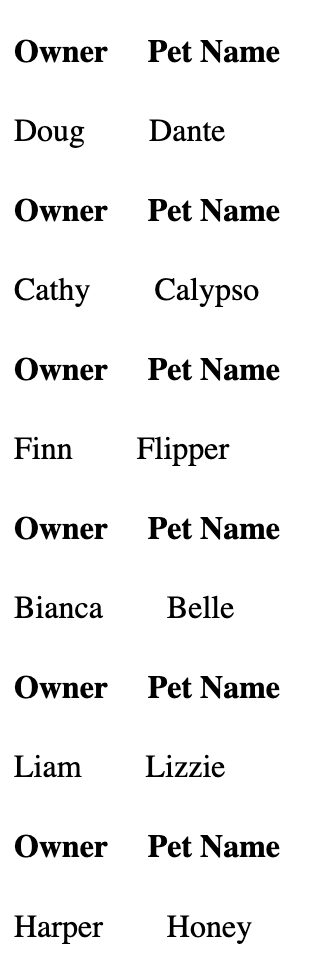

[View full source](https://github.com/wYaobiz/code-to-cloud-resources/blob/main/src/ch10-php-mysql/pdo-fetch-num/index.php){ .md-button }

### PDO fetch() with FETCH_BOTH

Sets PDO::FETCH_BOTH so each row is available both by column name and by position.

```php
<!DOCTYPE html>
<html>
<head>
<meta charset="UTF-8">
<title> mysqli function mysqli_num_fetch_array(MYSQLI_NUM)</title>
</head>
<?php
// File that includes information such as host server, username, data base name and password needed to connect to the database server
include('connect.php');
//Try catch block to catch connection errors
try
  {
    // Connect to your DB
    $connect = new PDO("mysql:host=$servername; dbname=$dbname", $username, $password);
    // set the PDO error mode to exception
    $connect->setAttribute(PDO::ATTR_ERRMODE, PDO::ERRMODE_EXCEPTION);
    //echo "Connected successfully";
       }
catch(PDOException $e)
      {
        echo "Connection failed: " . $e->getMessage();
      }
//Try catch block to catch SQL errors
try
  {
// Create a SELECT query that retrieves all the records from a DB table called Pets
$petquery="SELECT * FROM Pets";
// Execute the SELECT query
$petresults = $connect->query($petquery);
// Check if the SELECT query yielded a result set
if ($petresults)
 {
  //Loop through result set using fetch(PDO::FETCH_BOTH)
  while($row = $petresults-> fetch(PDO::FETCH_BOTH))
  {
  echo "<h4>Owner     Pet Type</h4>";
  //print the first and second elements
  echo $row["Owner"]."&nbsp". "&nbsp ". "&nbsp ". " &nbsp". "&nbsp ". $row["1"];
    echo "<br>";
  }
}
}
//Catch block to catch errors
catch(PDOException $error)
  {
    echo "<br><br>";
  echo "Query Statement failed: " . $error->getMessage();
  }
// Close the DB connection
$connect=null;
?>
</html>
```

**Produces:** each row printed showing that the values can be reached either way.

??? note "Check your understanding"
    Think about what the code above will produce, then expand to compare with the actual output.

    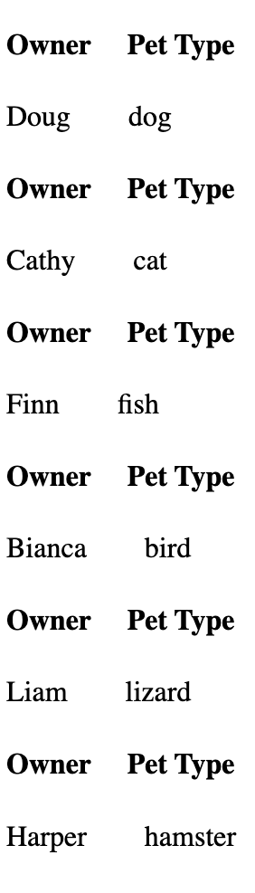

[View full source](https://github.com/wYaobiz/code-to-cloud-resources/blob/main/src/ch10-php-mysql/pdo-fetch-both/index.php){ .md-button }

